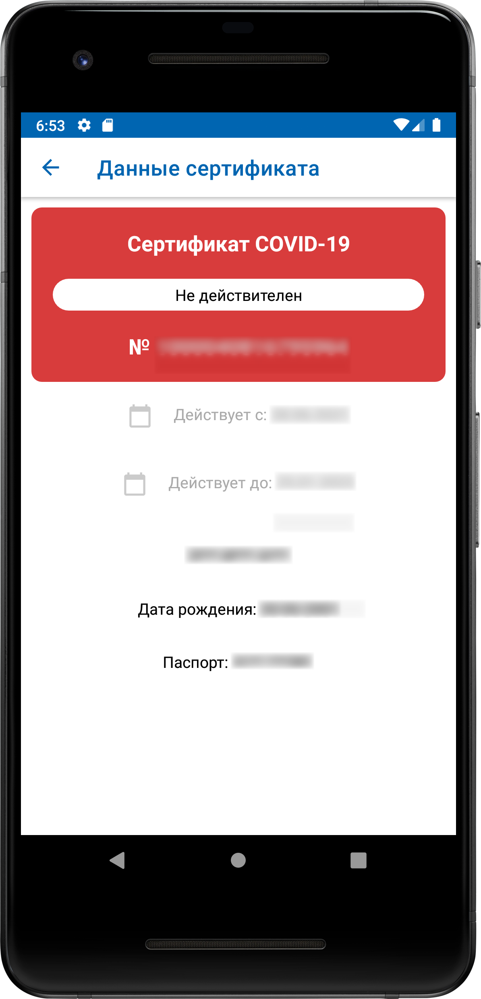
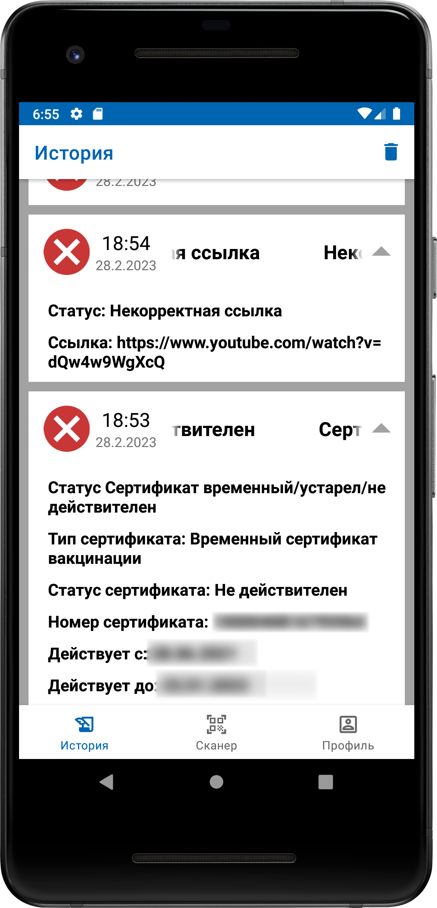

# Covid Certificate QR Scanner 

## Description
An example app for scanning and validating covid certificates QR codes. Made as pet-project against the backdrop of government decision to use QR codes as restrictions.

## App features
Application allows:
* Scan covid certificates QR codes
* Detect invalid QR codes (URLs or invalid data inside QR-code)
* Get personal data from certificate QR code
* Show certificate status (valid, expired or not exists)
* Detect certificate reuse within 12 hours (it keeps scanned history) 
* See scanned history

## Libraries
* <a href="https://github.com/yuriy-budiyev/code-scanner">code-scanner</a>

## Sceenshots
  

